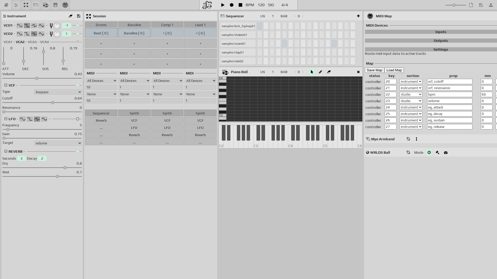

#  Jam Station

A web-based music production and live performance application built with Web Audio API and Web MIDI API. Create, sequence, and perform music directly in your browser.



## Features

- **Synthesizer Engine**: Multi-voice synthesis with VCO, VCA, VCF, ADSR, LFO, and Reverb
- **Piano Roll Editor**: Visual MIDI editor with selection, moving, and grid snapping (resizing and more features in development)
- **Sequencer**: Step-based pattern sequencer for creating rhythmic patterns
- **Session Management**: Multi-track session management with different instrument types
- **Sample Bank**: Load and play audio samples with sampler instruments
- **MIDI Support**: Full MIDI input/output support for external controllers and devices
- **OSC Support**: Open Sound Control for integration with other music software
- **Tap Tempo**: Tap to set BPM for live performance
- **Media Library**: Organize and manage your audio files and samples

## Installation
- Setup your node environment via https://github.com/creationix/nvm
- Clone the repo:
```sh
git clone https://github.com/alex-milanov/jam-station.git
cd jam-station
```
- Install the dependencies (using pnpm):
```sh
pnpm install
```

## Running the app

**Browser Requirements:** Web MIDI is currently supported only in Chrome-based browsers (Chrome, Edge, Opera)

1. Start the development server:
```sh
pnpm start
```

2. Open your browser at http://localhost:1234

3. The browser will automatically request permissions for audio and MIDI when the app loads - simply allow the prompts

4. Connect a MIDI keyboard or install a virtual MIDI keyboard app to start playing

**Note:** The app runs on port 1234 by default (Parcel's default port)

## Live Demo
The app is automatically deployed to GitHub Pages on every push to master:
- **Live version**: https://alex-milanov.github.io/jam-station/

## Development

**Status:** The app is currently in active development. The architecture may undergo refactorings as features are added and improved.

### Current Development Focus
- Piano roll interaction system (selection, moving, resizing)
- Service-based architecture migration
- UI testing infrastructure with Playwright

### App Architecture
The app architecture is influenced by recent trends like functional and functional reactive programming.

It's building blocks consist of:
- **State management**: Redux-inspired state machine using `iblokz-state`
- **Virtual DOM**: Hyperscript with `iblokz-snabbdom-helpers`
- **Reactive programming**: RxJS observables to connect different elements
- **Service-based architecture**: Self-contained, portable services (e.g., `piano-roll` service)

The application flow is one directional, flux-like:
- **Actions** -> **State** -> **UI** (-> **Actions**)

A central goal of this approach is to structure the app in a manner of how one might reason about it. For eg.:
- The `State` of the app is being changed by the user `Actions`
```js
const state$ = actions.stream
	.scan((state, change) => change(state), actions.initial);
```
- The `UI` of the app reflects it's `State`
```js
const ui$ = state$.pipe(
	map(state => ui({state, actions}))
);
```

### Dependencies
The app uses several `iblokz` libraries:
- `iblokz-audio` - Web Audio API utilities
- `iblokz-data` - Immutable data utilities
- `iblokz-state` - State management
- `iblokz-gfx` - Graphics utilities (geometry, canvas, grid)
- `iblokz-snabbdom-helpers` - Virtual DOM helpers

### Development Scripts
- **Start**: `pnpm start` - Start development server on http://localhost:1234
- **Build**: `pnpm run build` - Build the app for production (outputs to `dist/`)
- **Test**: `pnpm test` - Run the test suite with Mocha
- **Screenshot**: `pnpm run screenshot` - Take a screenshot of the app (requires app to be running)

### Building and Deployment
- **Build**: `pnpm run build` - Builds the app for production
- **Test**: `pnpm test` - Runs the test suite
- **Deploy**: Automatically deployed to GitHub Pages via GitHub Actions on push to `master`
- **Testing**: Playwright is set up for future UI/E2E testing

## License

This project is licensed under the **GNU Affero General Public License v3.0 (AGPL-3.0)**.

See [LICENSE](LICENSE) for the full license text.
